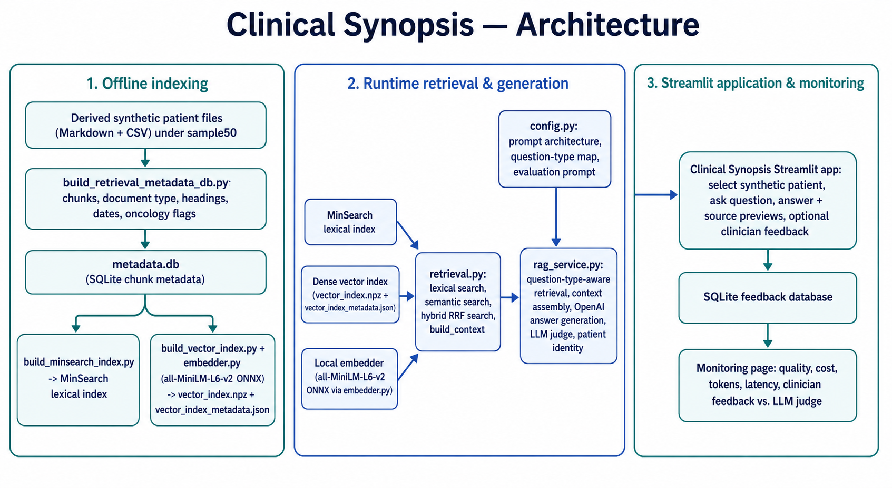

# Clinical Synopsis

Clinical Synopsis is a RAG application that transforms structured synthetic patient records—such as tables and spreadsheets of conditions, medications, procedures, diagnostic reports, and oncology events—into plain-language clinical summaries and answers.

Users can ask questions in natural language, review source-grounded responses, and inspect the underlying retrieved patient records for verification.

This project uses synthetic data and is a technical demonstration only. It is not intended for clinical decision-making.

## Live demo

Try the deployed application here: **[Clinical Synopsis App](https://llm-zoomcamp-capstone-project.streamlit.app/)**

## Demo video


**Request flow**
1. The user asks a question in the app.
2. The router chooses a question type or asks for clarification.
3. `rag_service` picks the corresponding prompt mode and retrieval scope from config.py.
4. retrieval.py fetches relevant chunks from the lexical, semantic, or hybrid index.
5. `build_context` formats those chunks into a prompt context.
6. The LLM generates the answer.
7. The judge evaluates grounding and relevance against the retrieved context.


## Features

- Synthetic patient selection
- Hybrid, semantic, and lexical retrieval
- Question routing
- Source-record previews
- Answer feedback collection
- Monitoring dashboard
- Retrieval and LLM-judge evaluation notebook

## Problem

Oncology patient records are clinically rich but difficult to review as a coherent narrative. Relevant information is distributed across structured electronic health record data such as encounters, conditions, medications, procedures, diagnostic reports, laboratory results, and oncology-related events. A clinician answering a specific question—such as *What treatment did the patient receive?* or *Is there evidence of progression?*—may need to connect information across multiple document types and time periods.

This project uses synthetic breast-cancer patient records from the mCODE STU2 lifetime/longitudinal dataset. mCODE is an HL7 FHIR-based standard that defines structured data elements for oncology EHRs. The records include both cancer-related data and broader non-cancer medical history.

The challenge is therefore not only retrieving individual records. It is producing a concise, clinically useful synthesis from mixed structured sources while keeping the answer traceable to the evidence used. The application should retrieve the appropriate context, distinguish relevant from irrelevant history, and make the underlying source records available for review.

## Solution

Clinical Synopsis converts selected structured synthetic patient records into a searchable patient corpus with document metadata. Users select a synthetic patient and ask a clinical question in natural language.

The application then:

1. Routes the question to a supported question type, such as patient overview, conditions, medications, or oncology timeline.
2. Retrieves relevant patient-specific evidence using hybrid, semantic, or lexical search.
3. Builds question-type-aware context from the retrieved records.
4. Generates a concise clinical answer from that context.
5. Displays the available underlying health-record sources so the answer can be reviewed against the retrieved evidence.
6. Collects optional answer feedback and the monitoring dashboard diplays quality, cost, token, routing and judge evaluation metrics.

The project evaluates both retrieval and generation. Retrieval is evaluated against manually defined ground truth. The generated answers are evaluated by reference-based LLM judge for relevance and source-grounding. 

Human review remains necessary because automated evaluation alone cannot establish clinical correctness. The Monitoring page compares clinician feedback with the LLM judge’s relevance and groundedness assessments to identify agreement and disagreement between the two.


## Data and knowledge base

The source dataset is the original synthetic mCODE/Synthea data; the knowledge base is the processed, chunked, metadata-enriched, and indexed patient corpus that the RAG system searches.

The project uses a selected sample of 50 synthetic breast-cancer patient records from the mCODE STU2 lifetime/longitudinal dataset. The original FHIR resources are transformed into derived patient-level Markdown and CSV records representing encounters, conditions, medications, procedures, diagnostic reports, and oncology-related timelines.

The derived records are split into chunks and stored with metadata including patient ID, document type, section heading, date range, and oncology flag. The same chunk metadata supports both a MinSearch lexical index and a local sentence-transformer vector index for semantic retrieval.

The data preparation pipeline is documented in
[`01_prepare_derived_patient_records.ipynb`](notebooks/01_prepare_derived_patient_records.ipynb).

The semi-automated knowledge-base ingestion workflow is documented in
[`02_build_knowledge_base.ipynb`](notebooks/02_build_knowledge_base.ipynb).


## Architecture




## Retrieval and LLM evaluation

The evaluation notebook in
[`04_evaluate_retrieval_prompt_routing.ipynb`](notebooks/04_evaluate_retrieval_prompt_routing.ipynb).
shows that my first version of the RAG pipeline, let's call it the Baseline, had a major problem with the basic prompting instructions. The issue was not the retrieval engine itself, but how the model was prompted once it received the retrieved context. Brief summary of the findings:

### 1. Retrieval was not the problem
I created a ground-truth set of 9 patients across low, medium, and high complexity, and defined gold chunks for four question types:
- patient overview
- conditions
- medications
- oncology timeline

For each question type, I evaluated lexical, semantic, and hybrid search using Hit@5 and MRR@5. The key takeaway was that retrieval was mostly able to surface relevant chunks. The model did not fail because it could not find the right evidence; it failed because once that evidence was passed into a generic prompt, the model often summarized too broadly or interpreted the data incorrectly.

### 2. Boost tuning had little effect
I tested several title/heading/chunk-text weighting configurations. Changing lexical boosts did not meaningfully improve retrieval quality. 

### 3. The answers were often relevant but not faithful or grounded
The notebook uses LLM-as-judge evaluation in two ways:
- relevance/groundedness against the retrieved context
- relevance/faithfulness/coverage against a reference summary

The reference-based judge claims that the answers are not just missing some gold conditions (which we expect because the reference is richer than the context), they’re also inventing conditions that are not in the data and misinterpreting the status (treating resolved as active, or vice versa).

Manually inspecting the high complexity patients I see that both the answers and the reference-based judge are wrong, because they have trouble putting together the information in the chunks from patient_overview.md and conditions.csv.

This is because patient_overview.md contains top 10 diagnostic reports, as an approximation for "recent results", which for complex patients with lots of records is an incomplete source for the summary. Reaching directly to the full record, conditions.csv, the two LLMs selects the most serious diagnoses from the life-time record and then are not able to infer which are the recent and/or active diagnoses.


### Why I ended up routing questions
I concluded that the poor accuracy of the answers is due to poor generation not retrieval. With a complex source (Recent Conditions heading in patient_overview.md + conditions.csv), the answer quality depends heavily on the **prompt and context**, not just retrieval.

The final approach is to:
1. detect the likely question type
2. select question-specific retrieval filters and document types
3. apply task-specific instructions in the prompt

This produces more reliable behavior because the model is told not to just “answer the question,” but to “answer this kind of clinical question in this particular way.”

Bottom line: the evidence showed that prompt and context selection mattered more than ranking tweaks, and routing was the cleanest way to make the app more accurate across the four supported clinical tasks.

## Monitoring

The dashboard includes the following metrics: 

**Quality summary**
- **Feedback records**: total number of feedback rows.  
- **Average score**: mean clinician feedback rating (1–5).  
- **Scores ≤ 2**: percentage of feedback with score ≤ 2 (poor ratings).  
- **Accuracy flags**: percent of records where clinician marked an accuracy issue.

Charts in this section:
- **Rating distribution**: histogram of clinician scores.  
- **Issue categories**: counts by issue type.  

**Usage and cost**
- **Feedback submissions**: the same count as Feedback records.  
- **Total input tokens**: sum of model input tokens.  
- **Total output tokens**: sum of model output tokens.  
- **Total estimated cost**: sum of recorded generation costs (`total_cost`).  
- **Generation + judge cost**: sum of `total_cost` + judge cost (`judge_total_cost`).

Charts in this section:
- **Feedback volume by day**: daily submission counts (time series).  
- **Estimated cost by question type**: total cost grouped by `question_type`.  
- **Token usage by retrieval method**: input/output token totals grouped by `search_type`.  
- **Answer-generation latency**: mean latency (seconds) by `question_type`.  


**Automated evaluation**
*LLM-as-a-judge results for clinician-reviewed answers. Use clinician feedback as the primary quality signal.*
- **Judged answers**: number of records that have judge (LLM) scores saved.  
- **Average overall score**: mean judge overall score (normalized scale used in notebook).  
- **Average relevance**: mean judge relevance score.  
- **Average groundedness**: mean judge groundedness score.

Two histograms in this section:
- **Judge-score distributions**
- **Groundedness distributions**

**Judge versus clinician feedback**
- **Comparable answers**: count of records that have both clinician feedback and a saved judge score.  
- **Mean score gap**: mean absolute normalized gap between clinician and judge scores.  
- **High/low agreement**: percent agreement on whether the answer is high-quality (binary high/low threshold).
- Table listing **Disagreement cases**

- Dropdown list to inspect recorded answers.


## Repository structure

- **Root:** README.md — project overview, run instructions, and demo.
- **Entry scripts:** Clinical_Synopsis.py — Streamlit UI and user interaction.
- **Core package:** clinical_synopsis — RAG logic and helpers.
- **Core files:** rag_service.py — RAG orchestration and prompt modes; retrieval.py — lexical/semantic/hybrid search; feedback.py — feedback persistence/monitoring; embedder.py — local embedder; config.py — runtime config and modes.
- **Indexing & build scripts:** build_minsearch_index.py, build_vector_index.py, build_retrieval_metadata_db.py.
- **Data & artifacts:** data — ingestion outputs and runtime artifacts.
    - **Derived data:** derived — processed patient records.
    - **Retrieval artifacts:** retrieval — `minsearch_index.pkl`, `minsearch_documents.json`, `vector_index.npz`, `vector_index_metadata.json`.
- **Monitoring:** monitoring — monitoring SQLite DB and feedback records.
- **Models:** all-MiniLM-L6-v2 — local embedding model files (ONNX/weights).
- **Notebooks:** 01_prepare_derived_patient_records.ipynb, 02_build_knowledge_base.ipynb, 04_evaluate_retrieval_prompt_routing.ipynb — ingestion, indexing, and evaluation experiments.

### Acknowledgements

- `clinical_synopsis/embedder.py` is adapted from DataTalksClub's llm-zoomcamp: https://github.com/DataTalksClub/llm-zoomcamp/blob/main/02-vector-search/embed/embedder.py.  
  Please see the upstream repository for the original implementation and licensing.


## How to run

### Tech stack

Python, Streamlit, OpenAI API, ONNX / Xenova, MinSearch, Pandas, SQLite, uv, Docker / Docker Compose

### Prerequisites

- git
- docker runtime
- An OpenAI API key
- [git-lfs](https://git-lfs.com/)

The Docker image includes the Streamlit application, locked Python
dependencies, embedding-model files, retrieval artifacts in
`data/retrieval/`, and source documents in `data/derived/`.

Pull the code with:

`git clone https://github.com/btomaszewicz/llm-zoomcamp-capstone-project.git`


### Build and Run
From the repository root:

```bash
docker compose up --rebuild
```

or without docker compose, 

```bash
docker build -t clinical-synopsis:local .
docker run --rm \
  -p 8501:8501 \
  -e OPENAI_API_KEY \
  clinical-synopsis:local
```

The app is then accessible at http://localhost:8501 in your browser.

## Development

The project uses Python and `uv` for dependency management. The committed
`pyproject.toml` specifies the project dependencies, while `uv.lock` records
the exact resolved versions used to create the environment.

To setup the local environment, first copy the `.env.example` into `.env`:
```bash
cp .env.example .env
```
then set the OPENAI_API_KEY in the `.env` file. 

To install the packages and run the development server:
```bash
uv sync --locked
uv run streamlit run clinical_synopsis/app.py
```


# Self-assessment scores with respect to the course evaluation rubric

| Criteria            | Self-assesment score | What supports it                                                                                                                                                             | Where in the project                                                                                                                                                                                                                                                   |
| -------------------- | -------------------- | ---------------------------------------------------------------------------------------------------------------------------------------------------------------------------- | ---------------------------------------------------------------------------------------------------------------------------------------------------------------------------------------------------------------------------------------------------------------------- |
| Problem description  | 2/2                  | **Problem**:  source-grounded patient synopsis from structured records. **Solution**: Users can ask questions in natural language and inspect the  retrieved patient records | [Problem](#problem)<br>and [Solution](#solution) above                                                                                                                                                                                                                 |
| Retrieval flow       | 2/2                  | SQLite metadata/chunks, keyword retrieval, vector index, context passed to LLM                                                                                               | [Data and knowledge base](#data-and-knowledge-base) and [Architecture](#architecture) above                                                                                                                                                                            |
| Retrieval evaluation | 2/2                  | Ground truth has been used for evaluation of keyword/lexical, vector and hybrid search                                                                                         | [Retrieval and LLM evaluation](#retrieval-and-llm-evaluation) above. [`04_evaluate_retrieval_prompt_routing.ipynb`](notebooks/04_evaluate_retrieval_prompt_routing.ipynb)                                                                                              |
| LLM evaluation       | 2/2                  | Comparison between `rag()` and `rag_new()`. Implementation of different prompt behavior via question routing.                                                                | [Retrieval and LLM evaluation](#retrieval-and-llm-evaluation) above. [`04_evaluate_retrieval_prompt_routing.ipynb`](notebooks/04_evaluate_retrieval_prompt_routing.ipynb)                                                                                              |
| Interface            | 2/2                  | Streamlit app and live Streamlit Cloud deployment                                                                                                                            | [Live demo](#live-demo), [Demo video](#demo-video) above.                                                                                                                                                                                                              |
| Ingestion pipeline   | 1/2                  | Semi-automated ingestion with a notebook or Python script.                                                                                                                   | [`02_build_knowledge_base.ipynb`](notebooks/02_build_knowledge_base.ipynb)                                                                                                                                                                                             |
| Monitoring           | 2/2                  | The app contains user feedback and a monitoring dashboard with 8 charts.                                                                                                     | [Monitoring](#monitoring) above. [Live demo](#live-demo), [Demo video](#demo-video) above.                                                                                                                                                                             |
| Containerization     | 2/2                  | Everything runs in Docker Compose.                                                                                                                                           | [How to run](#how-to-run) above.                                                                                                                                                                                                                                       |
| Reproducibility      | 2/2                  | Instructions are complete, versions/data are fully reproducible.                                                                                                             | [How to run](#how-to-run), [Development](#development) above.                                                                                                                                                                                                          |
| Hybrid search        | 1 bonus point        | vector index and hybrid search evaluated                                                                                                                                     | [Retrieval and LLM evaluation](#retrieval-and-llm-evaluation) above. [`04_evaluate_retrieval_prompt_routing.ipynb`](notebooks/04_evaluate_retrieval_prompt_routing.ipynb) Hybrid search can also be explicitly selected in the app, see [Live demo](#live-demo) above. |
| Cloud deployment     | 2 bonus points       | The Streamlit app is deployed to Streamlit Cloud                                                                                                                             | [Live demo](#live-demo) above.                                                                                                                                                                                                                                         |